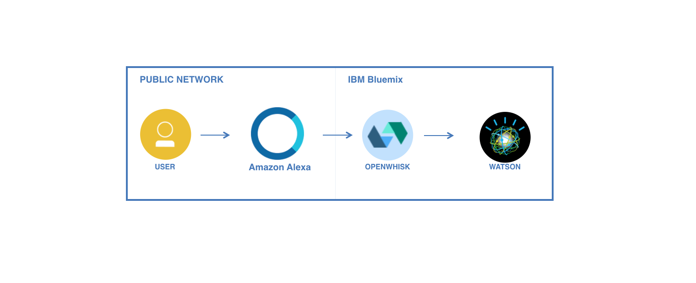
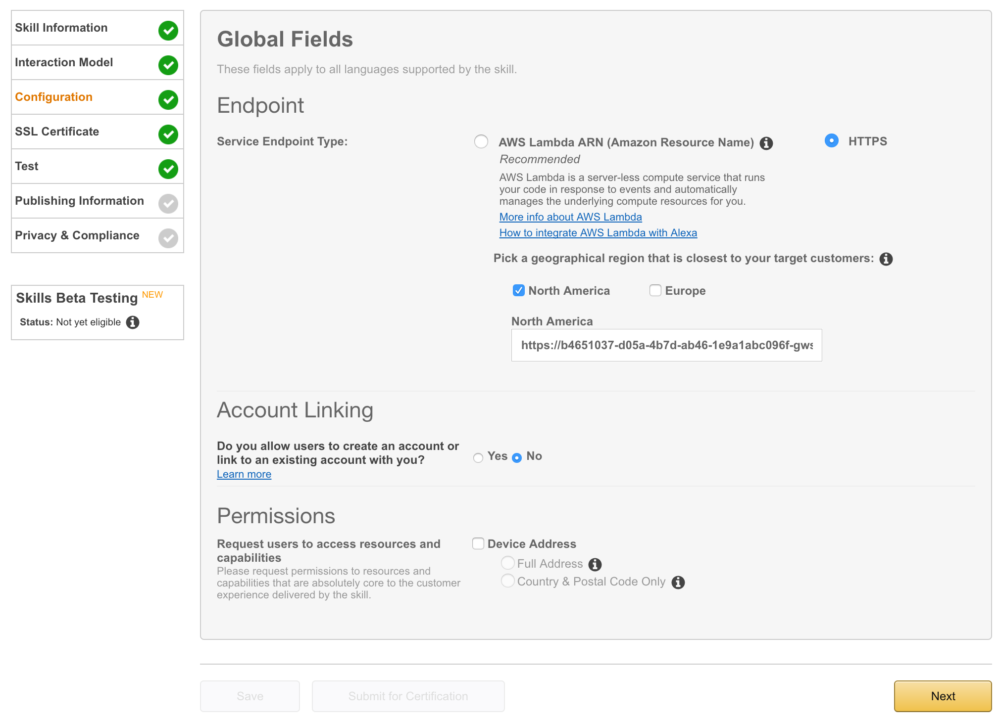

# Alexa & Watson Skill
Create Amazon Alexa skill that uses IBM Bluemix OpenWhisk to host the backend actions and IBM Watson Tone Analyzer to provide Alexa users with Quote where they are happy, sad, fear ect.
The skill is designed to give users a list of quotes where a user can ask things like:
> Alexa ask watson to play a random  
> Alexa ask watson to play a happy quote

If a happy quote is requested by Alexa then the Watson Tone Analyzer is used to find and play a quote where it has highest happy tone.

## Requirements 
1. [Amazon Developer Account](https://developer.amazon.com)
1. Alexa Device (Optional)
1. IBM Bluemix account. [Sign up](https://console.ng.bluemix.net/registration/?target=%2Fdashboard%2Fapps) for Bluemix, or use an existing account.



### Getting Started
Follow the steps below to create an Alexa skill, create the backend using IBM Bluemix OpenWhisk and use the Watson Tone to find a quote based on the user request.

1. Create A Skill  
Login to the Amazon developer console, go to Skills -> Alexa Skill Kit (Get Started) -> Add a new skill.

1. Give the skill a name: `Alexa & Watson`  

1. Give the skill an invocation name: `watson`  
    Invocation Name is what a user would speak into the Alexa device, for example I would say something like `Alexa ask watson to play a happy quote`
 
1. Next, under the **Interaction Model**, add the following:  
    *-> Intent Schema*   
    ```
    {
      "intents": [
        {
          "intent": "randomQuote"
        },
        {
          "intent": "happyQuote"
        }
      ]
    }
    ```
    > Intent Schema is the actions that the user can preform, in plain text it's what Alexa can do  

    *-> Slots*  
    In this example we wont be using Slots.
    > Slots are ways inject more specific user input into the Utterances. 
    An Example where you would use Slots where if you ask Alexa: Find me a restaurants in Dublin area, the city in that case would be the Slot.

    *-> Sample Utterances*  
    ```
    randomQuote watson to play a random quote
    randomQuote watson for a random quote
    
    happyQuote watson to play a happy quote
    happyQuote watson to for a happy quote   
    ```
    > Note: sample Utterances is a way to map words to the intents.

Next, under the **Configuration**, we will call the server side action api to link the skill to the backend. For that we will be using IBM Bluemix OpenWhisk to create the Action then expose the action as an API.

### Setting up OpenWhisk and Tone Analyzer service 

1. Clone or fork the repository 
1. Check out the code
1. Ensure your [OpenWhisk command line interface](https://console.ng.bluemix.net/openwhisk/cli) is properly configured with:
   
   ```
   wsk list
   ```
   > Note: this shows the packages, actions, triggers and rules currently deployed in your OpenWhisk namespace.

1. Create a Watson Tone Analyzer service using: 
    ```
    cf create-service tone_analyzer standard alexaAnalyzer
    ```
1. Obtain your Tone Analyzer credentials, from your [Bluemix console](https://console.ng.bluemix.net) under the service created you should be able to get the Service credentials.
1. Modify the action.js file by adding your Tone Analyzer username and password. 
1. Create OpenWhisk Action 
    ```
    wsk action create alexaAndWatson action.js
    ```
1. Expose your OpenWhisk Action as an API using:
    ```
    wsk api-experimental wsk api-experimental create /alexaWatson /api/v1 post alexaAndWatson --annotation web-export true
    ```
1. Copy the API endpoint in your console and past into the Amazon Alexa API filed, see image below. 
    You should see something like: 
    ```
    ok: created API /alexaWatson/api/v1 POST for action /_/alexaAndWatson
    https://b4651037-d05a-4b7d-ab46-1e9a1abc096f-gws.api-gw.mybluemix.net/alexaWatson/api/v1
    ```
    

Next, under the **SSL Certificate**, select the `My development endpoint is a sub-domain of a domain that has a wildcard certificate from a certificate authority` option.

Done! 

### Testing
Test the skill by adding this text to the "Enter Utterance" text filed area:  
> Alexa ask watson to play a random   
> Alexa ask watson to play a happy quote

**Output**: "0.624516% chances that the tone of this text is in the category of: Anger". 

- TODO Video showing this


### Additional information  
- [IBM Bluemix OpenWhisk site](https://console.ng.bluemix.net/openwhisk/)  
- [IBM Bluemix OpenWhisk keynote](keynote/OpenWhisk.key)  
- [OpenWhisk Form Processing](https://github.com/IBM-Bluemix/openwhisk-contact)  
- [More IBM Bluemix OpenWhisk Samples](https://ibm-bluemix.github.io/#!/)  


----

## Tone Analyzer JSON Output
```
{
    "document_tone": {
        "tone_categories": [
            {
                "category_id": "emotion_tone",
                "category_name": "Emotion Tone",
                "tones": [
                    {
                        "score": 0.881688,
                        "tone_id": "anger",
                        "tone_name": "Anger"
                    },
                    {
                        "score": 0.022428,
                        "tone_id": "disgust",
                        "tone_name": "Disgust"
                    },
                    {
                        "score": 0.074133,
                        "tone_id": "fear",
                        "tone_name": "Fear"
                    },
                    {
                        "score": 0.006716,
                        "tone_id": "joy",
                        "tone_name": "Joy"
                    },
                    {
                        "score": 0.092043,
                        "tone_id": "sadness",
                        "tone_name": "Sadness"
                    }
                ]
            },
            {
                "category_id": "language_tone",
                "category_name": "Language Tone",
                "tones": [
                    {
                        "score": 0,
                        "tone_id": "analytical",
                        "tone_name": "Analytical"
                    },
                    {
                        "score": 0,
                        "tone_id": "confident",
                        "tone_name": "Confident"
                    },
                    {
                        "score": 0,
                        "tone_id": "tentative",
                        "tone_name": "Tentative"
                    }
                ]
            },
            {
                "category_id": "social_tone",
                "category_name": "Social Tone",
                "tones": [
                    {
                        "score": 0.022751,
                        "tone_id": "openness_big5",
                        "tone_name": "Openness"
                    },
                    {
                        "score": 0.234966,
                        "tone_id": "conscientiousness_big5",
                        "tone_name": "Conscientiousness"
                    },
                    {
                        "score": 0.366922,
                        "tone_id": "extraversion_big5",
                        "tone_name": "Extraversion"
                    },
                    {
                        "score": 0.567783,
                        "tone_id": "agreeableness_big5",
                        "tone_name": "Agreeableness"
                    },
                    {
                        "score": 0.001604,
                        "tone_id": "emotional_range_big5",
                        "tone_name": "Emotional Range"
                    }
                ]
            }
        ]
    }
}
```

## Useful OpenWhisk Commands
| Commands | Description |
| ---- | ----------- |
|$ wsk --help| Wsk help to find available commands |
|$ wsk activation poll| Useful for troubleshooting to view logs and errors  |
|$ wsk action create 'Action_Name' 'Action_File'| To create OpenWhisk action |
|$ wsk action list| list all OpenWhisk actions |
|$ wsk api-experimental create /'Api_Name' /'Api_Path' post 'Action_Name'| Expose action as a API  |
|$ wsk api-experimental list| List all API's |


## License
See [License.txt](License.txt) for license information.

---

This project is a sample application created for the purpose of demonstrating a serverless app with OpenWhisk. The program is provided as-is with no warranties of any kind, express or implied.

[bluemix_signup_url]: https://console.ng.bluemix.net/?cm_mmc=GitHubReadMe